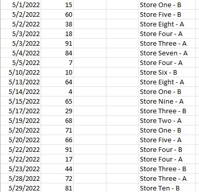
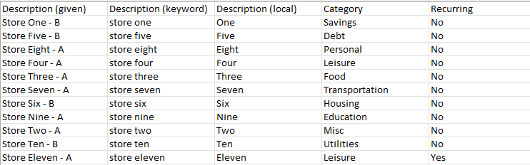
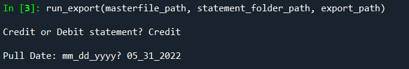
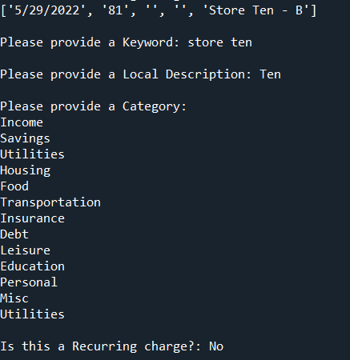

# Expense_Tracker
Takes in bank statements (csv format), automatically categorizes, appends appropriate data fields, and triggers a prompt for further information in the case of an unknown entry. Uses Python.

## Table of Contents:
- [A Look Under the Hood](#a-look-under-the-hood)
- [Statements](#statements)
- [Exports](#exports)
- [Masterfile](#masterfile)
- [The Program in Action](#the-program-in-action)

## A Look Under the Hood
There is a single code file used for this project, consisting of five functions, with the fifth function using the prior four functions to execute the entire concept.
- masterfile_import: Imports a file of unique keywords and associations.
- statement_info: Prompts the user for information about which statement to manipulate.
- import_statement: Imports the statement the user specified in statement_info.
- gather_keys: Parses through specified statement to look for new unique keys to add to the masterfile, updates the export file as well as masterfile. Will prompt user if a new unique key is found.
- run_export: This brings together the above functions, and will save the updated masterfile as well as save a new export file with nomenclature specific to the statement.

[Table of Contents](#table-of-contents)

## Statements
The statements used in this example have three applicable data fields:
- Date
- Cost
- Transaction ID (Given Name)
 
The data is partially randomly generated, and tries to mimic a real statement of this format. The Transaction IDs are simplified from a realistic statement, which generally consist of a something resembling the name of the place of business and then an arbitrary jumble of characters, but still serve the purpose of explaining this program.

[Table of Contents](#table-of-contents)

## Exports
In a realistic statement, the Transaction ID column is much too arbitrary to perform any analysis on. To solve for this, an export file is created with the following data fields:
- Date
- Transaction ID (Given Name)
- Keyword Name (key)
- Local Name
- Category
- Recurring Charge
- Cost
- Credit vs. Debit

This gives us more actionable data to perform analysis on.

[Table of Contents](#table-of-contents)

## Masterfile
How do we go from a transaction file to an export file? The has to do with keys in the Transaction ID of the statement, which remember, is usually a jumble. Take "Store One - A" from the above example. If we use use the key "store one", anytime in the future a Transaction ID contain "store one" is found, it knows to use the information stored in the masterfile regarding "store one". But it does keep the possibly variable data such as Date, Transaction ID, Cost, and Card Type.

With this in mind, the masterfile contains the datafields:
- Transaction ID (Given Name)
- Keyword Name (key)
- Local Name
- Category
- Recurring

[Table of Contents](#table-of-contents)

## The Program in Action
The program needs a masterfile path prepared (if this is the first time running the program, this can be to a blank CSV file), a statement path prepared, and a path to save the exported file.

After specifying the locations, when the user runs the program, anytime there is a unique Statement ID (i.e. no key match), the program will display the information from the statement entry and prompt the user for the remaining information missing from the masterfile datafields.

For purposes of this repository, two statements with partially randomly generated data were prepared, and the program was run for the "05_31_2022" statement and then the "06_30_2022" statement. The progression of the runs can found in the supporting documents above in the folders "Master_Files_Example" and "Exports_Example".

[Table of Contents](#table-of-contents)
